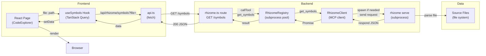

# Cap Internals

Web dashboard for the claude-mycelium ecosystem: Hyphae memories, Mycelium token savings, and Rhizome code intelligence in one UI.

## Architecture Overview

```
Frontend (React)                Backend (Hono)
┌─────────────────────┐        ┌──────────────────────┐
│ src/pages/*         │        │ server/routes/*      │
│ (lazy-loaded)       │        │ (Hono route groups)  │
└──────────┬──────────┘        └──────────┬───────────┘
           │                              │
           ├─ src/lib/api.ts ────────────→ index.ts
           │  (typed fetch)               │
           │                              ├─ db.ts (sqlite read)
           │                              ├─ hyphae.ts (CLI wrapper)
           │                              ├─ rhizome.ts (MCP client)
           │                              └─ rhizome-registry.ts
           │
           └─ src/lib/queries.ts
              (TanStack Query hooks)
```

## Frontend

### Route Configuration

`src/App.tsx`: lazy-loaded routes with `React.lazy()` and `Suspense`.

```tsx
const App = () => (
  <Suspense fallback={<PageLoader />}>
    <Routes>
      <Route element={<AppLayout />} path="/">
        <Route element={<Dashboard />} index />
        <Route element={<Memories />} path="memories" />
        <Route element={<Memoirs />} path="memoirs" />
        <Route element={<Sessions />} path="sessions" />
        <Route element={<Lessons />} path="lessons" />
        <Route element={<Analytics />} path="analytics" />
        <Route element={<CodeExplorer />} path="code" />
        <Route element={<Diagnostics />} path="diagnostics" />
        <Route element={<Settings />} path="settings" />
        <Route element={<Status />} path="status" />
        <Route element={<SymbolSearch />} path="symbols" />
      </Route>
    </Routes>
  </Suspense>
);
```

Lazy loading reduces initial bundle size. Each page is a separate chunk loaded on demand.

### Pages

| Page | Purpose |
|------|---------|
| `Dashboard` | Ecosystem status badges, top topics, memory health summary |
| `Memories` | Browse with FTS search, detail modal, importance/weight UI |
| `Memoirs` | Concept graph viewer, depth control, navigation history |
| `Sessions` | Timeline of work sessions, task/file tracking |
| `Lessons` | Extracted corrections, errors, and test patterns |
| `Analytics` | Token savings charts, memory growth, code intel usage |
| `CodeExplorer` | File tree + symbol outline, find references, tests |
| `SymbolSearch` | Global symbol search via Rhizome |
| `Diagnostics` | LSP error/warning viewer |
| `Settings` | Ecosystem configuration (LSP, Hyphae, Mycelium) |
| `Status` | Health dashboard across all three components |

### Typed API Client

`src/lib/api.ts`: fetch wrappers for `/api/*` endpoints.

```typescript
async function get<T = unknown>(path: string, params?: Record<string, string>): Promise<T> {
  const url = new URL(`${BASE}${path}`, window.location.origin);
  if (params) {
    for (const [k, v] of Object.entries(params)) {
      if (v) url.searchParams.set(k, v);
    }
  }
  const res = await fetch(url.toString());
  if (!res.ok) throw new Error(await extractErrorMessage(res));
  return res.json() as Promise<T>;
}
```

Three API namespaces:
- `hyphaeApi`: /api/hyphae/* (memories, memoirs, topics, search)
- `rhizomeApi`: /api/rhizome/* (symbols, structure, definitions, search, diagnostics)
- `myceliumApi`: /api/mycelium/* (gain, history)
- `settingsApi`: /api/settings/* (ecosystem config)
- `statusApi`: /api/status/* (health checks)

### TanStack Query Integration

`src/lib/queries.ts`: React Query hooks and cache key factories.

```typescript
export const hyphaeKeys = {
  analytics: () => ['hyphae', 'analytics'] as const,
  health: (topic?: string) => ['hyphae', 'health', topic] as const,
  recall: (q: string, topic?: string, limit?: number) =>
    ['hyphae', 'recall', q, topic, limit] as const,
};

export function useRecall(q: string, topic?: string, limit?: number) {
  return useQuery({
    enabled: !!q.trim(),
    queryFn: () => hyphaeApi.recall(q, topic, limit),
    queryKey: hyphaeKeys.recall(q, topic, limit),
  });
}
```

**Key patterns:**
- `enabled`: disable query if required params are empty
- `staleTime`: 5 min for symbols, 1 min for project info (source of truth changes)
- `keepPreviousData`: for concept depth controls (smooth UX while loading)
- `placeholderData`: use old data while refetching (FTS searches)

Cache invalidation on mutations:

```typescript
export function useDeleteMemory() {
  const queryClient = useQueryClient();
  return useMutation({
    mutationFn: (id: string) => hyphaeApi.deleteMemory(id),
    onSuccess: () => {
      queryClient.invalidateQueries({ queryKey: ['hyphae'] });
    },
  });
}
```

## Backend

### Server Setup

`server/index.ts`: Hono app factory with middleware and graceful shutdown.

```typescript
export function createApp(): Hono {
  const app = new Hono();

  // Middleware: request logging
  app.use('*', async (c, next) => {
    const start = Date.now();
    await next();
    logger.info({ ms: Date.now() - start, path: c.req.path, status: c.res.status });
  });

  // CORS
  app.use('*', cors({ origin: CORS_ORIGIN }));

  // Error handling
  app.onError((err, c) => {
    logger.error({ err }, 'Request error');
    return c.json({ error: 'Internal server error' }, 500);
  });

  // Routes
  app.route('/api/hyphae', hyphaeRoutes);
  app.route('/api/rhizome', rhizomeRoutes);
  app.route('/api/mycelium', myceliumRoutes);
  app.route('/api/status', statusRoutes);

  return app;
}

const app = createApp();
serve({ fetch: app.fetch, port: 3001 });

// Graceful shutdown
function shutdown() {
  registry.destroyAll();  // Kill Rhizome subprocesses
  closeDb();
  process.exit(0);
}
process.on('SIGINT', shutdown);
process.on('SIGTERM', shutdown);
```

### Database Access

`server/db.ts`: better-sqlite3 connection (read-only).

```typescript
function defaultDbPath(): string {
  const home = homedir();
  if (platform() === 'darwin') {
    return join(home, 'Library', 'Application Support', 'hyphae', 'hyphae.db');
  }
  return join(process.env.XDG_DATA_HOME ?? join(home, '.local', 'share'), 'hyphae', 'hyphae.db');
}

export function getDb(): DatabaseType | null {
  if (initialized) return db;
  initialized = true;
  try {
    db = new Database(process.env.HYPHAE_DB ?? DEFAULT_DB_PATH, { readonly: true });
  } catch (err) {
    logger.warn({ error: message }, 'Hyphae database not available');
    db = null;
  }
  return db;
}
```

**Important:** read-only mode prevents accidental writes. Write operations use the `hyphae` CLI.

### Hyphae Integration

`server/hyphae.ts`: read-only SQLite queries + CLI wrapper for writes.

**Reads** (direct SQLite):

```typescript
export function getStats(): StatsResult {
  const db = getDb();
  if (!db) return defaultStats;
  const row = db
    .prepare(
      `SELECT COUNT(*) as total_memories, AVG(weight) as avg_weight, ...
       FROM memories`
    )
    .get() as StatsResult;
  return row;
}

export function recall(query: string, topic?: string, limit = 20): MemoryRow[] {
  const db = getDb();
  if (!db) return [];
  return db
    .prepare(
      `SELECT m.* FROM memories m
       JOIN memories_fts fts ON m.rowid = fts.rowid
       WHERE memories_fts MATCH ? ...`
    )
    .all(query, topic) as MemoryRow[];
}
```

**Writes** (shell out to CLI):

```typescript
const runCli = createCliRunner(process.env.HYPHAE_BIN ?? 'hyphae', 'hyphae');

export async function store(topic: string, summary: string, importance?: string) {
  const args = ['store', '-t', topic, '-c', summary];
  if (importance) args.push('-i', importance);
  return runCli(args);
}

export async function forget(id: string) {
  return runCli(['forget', id]);
}
```

**Concept graph traversal** (BFS):

```typescript
export function memoirInspect(memoirName: string, conceptName: string, depth = 2) {
  const db = getDb();
  // BFS to collect neighbors, then batch-fetch concept details
  const neighbors = [];
  let frontier = [concept.id];

  for (let d = 0; d < depth && frontier.length > 0; d++) {
    for (const nodeId of frontier) {
      // Fetch outgoing and incoming links
      const outgoing = db.prepare(
        `SELECT cl.*, c.* FROM concept_links cl
         JOIN concepts c ON c.id = cl.target_id
         WHERE cl.source_id = ?`
      ).all(nodeId);
      // Add to frontier if not visited
    }
  }

  // Batch-fetch all concepts in one query
  const allConcepts = db.prepare(`SELECT * FROM concepts WHERE id IN (...)`).all(...ids);
  const conceptMap = new Map(allConcepts.map(c => [c.id, c]));

  // Build result with neighbor metadata
  return { neighbors, concept };
}
```

### Rhizome Integration

`server/rhizome.ts`: MCP client for Rhizome subprocess.

```typescript
export class RhizomeClient {
  private proc: ChildProcess | null = null;
  private pending = new Map<number, PendingRequest>();
  private stdoutBuffer = '';
  private nextId = 1;

  async callTool(name: string, args: Record<string, unknown> = {}): Promise<unknown> {
    await this.ensureRunning();
    const id = this.nextId++;
    const request = {
      id, jsonrpc: '2.0', method: 'tools/call',
      params: { arguments: args, name },
    };
    return new Promise((resolve, reject) => {
      const timer = setTimeout(() => {
        this.pending.delete(id);
        reject(new Error(`Tool call timeout: ${name}`));
      }, 10_000);
      this.pending.set(id, { resolve, reject, timer });
      this.send(request);
    });
  }

  private async ensureRunning(): Promise<void> {
    if (this.proc && this.proc.exitCode === null) return;
    // Kill old process, spawn new with `--expanded` for unified tool mode
    this.proc = spawn('rhizome', ['serve', '--expanded', '--project', PROJECT_ROOT]);
    this.proc.stdout?.on('data', (chunk) => {
      this.stdoutBuffer += chunk.toString();
      this.processBuffer();  // Parse newline-delimited JSON
    });
  }

  private processBuffer(): void {
    const lines = this.stdoutBuffer.split('\n');
    this.stdoutBuffer = lines.pop() ?? '';
    for (const line of lines) {
      const msg = JSON.parse(line);
      if (msg.id === undefined) continue;  // Notification
      const pending = this.pending.get(msg.id);
      if (msg.error) pending?.reject(new Error(msg.error.message));
      else pending?.resolve(msg.result?.content?.[0]?.text || msg.result);
    }
  }
}
```

**Key features:**
- Auto-spawn if process exits (check `exitCode === null`)
- Newline-delimited JSON framing (not Content-Length)
- 10-second timeout per tool call
- Unified mode (`--expanded`) → single `rhizome` tool with `command` arg

### Rhizome Registry

`server/lib/rhizome-registry.ts`: multi-project subprocess pool.

```typescript
class RhizomeRegistry {
  private clients = new Map<string, RhizomeClient>();
  private activeProject: string;
  private recentProjects: string[] = [];
  private maxClients = 3;

  getOrCreate(project: string): RhizomeClient {
    if (!this.clients.has(project)) {
      if (this.clients.size >= this.maxClients) {
        this.evictOldest();  // LRU eviction
      }
      const client = new RhizomeClient({ bin: 'rhizome', project });
      this.clients.set(project, client);
    }
    return this.clients.get(project)!;
  }

  switchProject(projectPath: string): RhizomeClient {
    this.activeProject = projectPath;
    this.recentProjects = [
      projectPath,
      ...this.recentProjects.filter(p => p !== projectPath),
    ].slice(0, 10);
    return this.getOrCreate(projectPath);
  }

  destroyAll(): void {
    for (const [, client] of this.clients) {
      client.destroy();
    }
    this.clients.clear();
  }
}

export const registry = new RhizomeRegistry(process.env.RHIZOME_PROJECT ?? process.cwd());
```

**Design:**
- LRU cache with max 3 clients (configurable)
- Recent projects list (up to 10) for UI persistence
- Graceful cleanup on shutdown

### Route Groups

#### Rhizome Routes (`server/routes/rhizome.ts`)

```typescript
const app = new Hono();

// Endpoint factory
function endpoint(tool: string, required: string[], optional: string[] = []) {
  return async (c: Context) => {
    const params: Record<string, unknown> = {};
    for (const key of required) {
      const val = c.req.query(key);
      if (!val) return c.json({ error: `Missing: ${key}` }, 400);
      params[key] = val;
    }
    return registry.getActive().callTool(tool, params);
  };
}

// Simple endpoints
app.get('/symbols', endpoint('get_symbols', ['file']));
app.get('/structure', endpoint('get_structure', ['file'], ['depth']));
app.get('/definition', endpoint('get_definition', ['file', 'symbol']));

// Numeric validation
function numericEndpoint(tool: string, requiredStr: string[], requiredNum: string[]) {
  return async (c: Context) => {
    const params: Record<string, unknown> = {};
    for (const key of requiredNum) {
      const raw = c.req.query(key);
      const num = parseNumberParam(raw as string);
      if (num === undefined) return c.json({ error: `${key} must be a number` }, 400);
      params[key] = num;
    }
    return registry.getActive().callTool(tool, params);
  };
}

app.get('/references', numericEndpoint('find_references', ['file'], ['line', 'column']));
app.get('/hover', numericEndpoint('get_hover_info', ['file'], ['line', 'column']));

// Project switching
app.post('/project', async (c) => {
  const { path } = await c.req.json();
  if (!existsSync(path) || !statSync(path).isDirectory()) {
    return c.json({ error: 'Invalid path' }, 400);
  }
  registry.switchProject(path);
  return c.json({ active: registry.getActiveProject(), recent: registry.getRecentProjects() });
});
```

#### Hyphae Routes (`server/routes/hyphae.ts`)

```typescript
app.get('/stats', (c) => c.json(hyphae.getStats()));
app.get('/recall', (c) => {
  const q = c.req.query('q') || '';
  const topic = c.req.query('topic');
  const limit = parseNumberParam(c.req.query('limit')) || 20;
  return c.json(hyphae.recall(q, topic, limit));
});
app.get('/memoirs/:name/inspect/:concept', (c) => {
  const depth = parseNumberParam(c.req.query('depth')) || 2;
  return c.json(hyphae.memoirInspect(c.req.param('name'), c.req.param('concept'), depth));
});
app.post('/store', async (c) => {
  const { topic, summary, importance } = await c.req.json();
  const result = await hyphae.store(topic, summary, importance);
  return c.json({ result });
});
```

#### Status Routes (`server/routes/status.ts`)

```typescript
app.get('/', async (c) => {
  const mycelium = { available: !!which.sync('mycelium', { nothrow: true }) };
  const hyphae = { available: !!getDb() };
  const rhizome = { available: registry.getActive().isAvailable() };
  return c.json({ mycelium, hyphae, rhizome });
});
```

## Data Flow Diagram



## Deployment

### Environment Variables

| Variable | Default | Purpose |
|----------|---------|---------|
| `PORT` | `3001` | Backend port |
| `HYPHAE_DB` | `~/.local/share/hyphae/hyphae.db` | Hyphae database path |
| `HYPHAE_BIN` | `hyphae` | Hyphae CLI binary |
| `RHIZOME_BIN` | `rhizome` | Rhizome CLI binary |
| `RHIZOME_PROJECT` | `process.cwd()` | Code project root |
| `CORS_ORIGIN` | Localhost origin | CORS header |

### Development

```bash
npm run dev:all      # Frontend (5173) + Backend (3001) concurrently
# Vite dev proxy automatically forwards /api/* to backend:3001
```

### Production

```bash
npm run build        # tsc -b && vite build
npm run preview      # Preview production build on localhost:4173
```

Build outputs:
- `dist/index.html` + `dist/assets/` (frontend)
- TypeScript checks enabled (strict mode)
- Biome for linting/formatting

## Key Design Decisions

1. **Read-only SQLite**: prevents accidental data corruption; writes use `hyphae` CLI (already validated)
2. **Subprocess per project**: allows analyzing multiple projects without process overhead
3. **LRU eviction**: max 3 Rhizome subprocesses (configurable) to avoid resource exhaustion
4. **Lazy routes**: React.lazy + Suspense reduces initial bundle
5. **TanStack Query**: centralized cache with smart invalidation
6. **Unified Rhizome mode**: single `rhizome` tool in expanded mode reduces tool count
7. **CLI wrapper for writes**: reuses Hyphae's validation and error handling
8. **Graceful shutdown**: `destroyAll()` on SIGINT/SIGTERM ensures processes are killed

## Error Handling

**Frontend:**
- Try/catch in async functions
- Error boundary wraps pages
- API errors converted to user messages

**Backend:**
- Hono `onError` middleware logs and responds with 500
- CLI subprocess errors caught and returned as tool errors
- DB connection failures gracefully degrade (null checks everywhere)
- Path validation prevents traversal attacks

**MCP Communication:**
- Timeout after 10 seconds per tool call
- Process exit detected and respawned on next call
- JSON parse failures logged and skipped

## Testing

**Frontend:** Vite + Vitest (not implemented in this overview)

**Backend:** Integration tests via real Hyphae/Rhizome instances (expected, not in scope)

**Manual:** Local dev with all three components running via `npm run dev:all`
