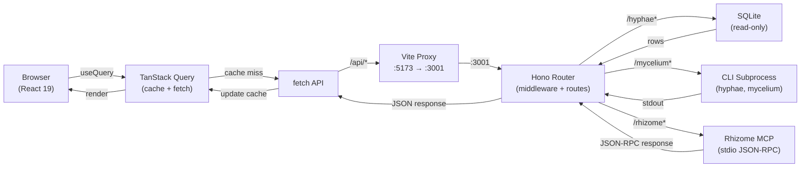

# Cap Internals

This document covers the architecture and data flow of Cap's backend (Hono server, SQLite, subprocesses) and frontend (React 19, TanStack Query). Read it when tracing a request end-to-end or understanding where a specific behavior lives.

---

# Backend: Hono Server

## App Initialization

**Entry point**: `server/index.ts` exports `createApp()` factory function.

```typescript
const app = new Hono()
// Middleware stack:
// 1. Timing + logging (all requests)
// 2. CORS (configurable origin)
// 3. Global error handler (500 on uncaught error)
// 4. Route registration (9 API namespaces)
```

**Graceful shutdown** on SIGINT/SIGTERM:
- Destroys all active Rhizome subprocess clients
- Closes SQLite database connection
- Exits process

## Middleware Stack

| Order | Purpose | Details |
|-------|---------|---------|
| 1 | Timing & logging | Records method, path, status, latency |
| 2 | CORS | Allows frontend origin (configured via `CORS_ORIGIN`) |
| 3 | Error handler | Catches thrown errors, returns 500 with generic message |

## Route Organization

Each route module exports a `Hono` app and is mounted at a namespace:

```typescript
app.route('/api/canopy', canopyRoutes)
app.route('/api/hyphae', hyphaeRoutes)
app.route('/api/lsp', lspRoutes)
app.route('/api/mycelium', myceliumRoutes)
app.route('/api/rhizome', rhizomeRoutes)
app.route('/api/settings', settingsRoutes)
app.route('/api/status', statusRoutes)
app.route('/api/telemetry', telemetryRoutes)
app.route('/api/usage', usageRoutes)
```

The backend is read-only for the direct SQLite Hyphae connection only. Several
route namespaces still write through to sibling tools or config files:

- `canopy` mutates task and handoff state via action endpoints
- `hyphae` forwards store, forget, invalidate, importance, and consolidate operations
- `rhizome` can rename symbols, move/copy symbols, and switch projects
- `settings` writes tool config files and runs setup/repair actions
- `lsp` can install language servers

---

# Database: Read-Only SQLite (Hyphae)

## Connection Model

**File**: `server/db.ts`

- Single persistent connection instance (lazy initialization)
- Opens in **read-only mode** (no write capability)
- Platform-aware default path:
  - macOS: `~/Library/Application Support/hyphae/hyphae.db`
  - Linux: `$XDG_DATA_HOME/hyphae/hyphae.db` or `~/.local/share/hyphae/hyphae.db`
- Environment override: `HYPHAE_DB`

## Null Handling

Connection can be `null` if database file is missing:

```typescript
const db = getDb()  // Returns DatabaseType | null

if (!db) {
  // Database unavailable, return graceful fallback or error
}
```

**Pattern**: Routes check nullability before querying. On null, return `{ error: 'Database unavailable' }` or empty dataset with warning.

## Write Operations

Cap does **not** write directly to SQLite. Write operations (store, forget, consolidate) shell out to the `hyphae` CLI:

- CLI performs validation
- CLI applies domain logic
- Database updated atomically
- Prevents circumventing constraints

---

# Rhizome Integration: Subprocess Pool

## RhizomeRegistry (LRU Subprocess Pool)

**File**: `server/lib/rhizome-registry.ts`

Manages persistent subprocess instances for code intelligence tools.

**Configuration**:
- Max concurrent clients: **3**
- Recent projects tracked: **10** (MRU list)
- Default project: `RHIZOME_PROJECT` (or `process.cwd()`)

**LRU Eviction**:
- When pool is at capacity (3 clients) and a new project is requested
- Evict least-recently-used client (excluding the active project)
- Destroy subprocess, free resources

**API**:

```typescript
registry.getActive()           // Get client for active project
registry.getActiveProject()    // Get path of active project
registry.getRecentProjects()   // Get list of 10 recent projects
registry.switchProject(path)   // Switch active project + update MRU
registry.destroyAll()          // Cleanup on shutdown
```

## RhizomeClient (MCP via JSON-RPC)

**File**: `server/rhizome.ts`

Wraps rhizome CLI subprocess, implements MCP protocol over stdio.

**Lifecycle**:
1. Subprocess spawned lazily on first tool call
2. Writes JSON-RPC request to stdin
3. Reads JSON-RPC response from stdout
4. Resolves pending request promise

**Auto-Restart**:
- If subprocess exits unexpectedly, next tool call re-spawns it
- Handles subprocess crashes gracefully (doesn't crash server)

**Tool Call Timeout**: 10 seconds per call (configurable)

**Availability Check**: Caches platform-aware command discovery for `rhizome` to avoid repeated filesystem checks

**Path Provenance**:
- Settings and runtime status expose both the resolved path and the reason it was selected
- Provenance values are `config_file`, `env_override`, and `platform_default`
- This keeps the UI aligned with the backend instead of guessing whether a displayed path is active or just the fallback location

## Endpoint Factory Pattern

**File**: `server/routes/rhizome.ts` (first 50 lines)

DRY pattern for wrapping tool calls in route handlers:

```typescript
function endpoint(tool: string, required: string[], optional: string[] = []) {
  return async (c: Context) => {
    const params: Record<string, unknown> = {}
    // Extract + parse required params
    // Extract + parse optional params
    // Coerce numeric params (line, column, depth)
    return rhizomeTool(c, tool, params)
  }
}

// Usage:
app.get('/search', endpoint('globalSearch', ['pattern'], ['path']))
```

---

# Frontend: React 19 + TanStack Query

## Route Configuration

**File**: `src/App.tsx`

Lazy-loaded pages using React 19 code splitting:

```typescript
const Analytics = lazy(() =>
  import('./pages/Analytics').then(m => ({ default: m.Analytics }))
)
```

**Route Tree**:
- Dashboard (index)
- Memories, Memoirs, Sessions, Lessons
- Analytics, CodeExplorer, SymbolSearch
- Diagnostics, Settings, Status

**Loading fallback**: PageLoader component (spinner/skeleton)

**Error boundary**: ErrorBoundary component catches render errors

## Data Fetching Pattern

**File**: `src/lib/queries.ts`

Uses TanStack Query with query key factory pattern:

```typescript
export const hyphaeKeys = {
  analytics: () => ['hyphae', 'analytics'] as const,
  recall: (q: string, topic?: string, limit?: number) =>
    ['hyphae', 'recall', q, topic, limit] as const,
  // ... 20+ query keys
}

export function useContext(task: string, project?: string) {
  return useQuery({
    enabled: !!task.trim(),
    queryFn: () => hyphaeApi.context(task, project),
    queryKey: hyphaeKeys.context(task, project),
  })
}
```

## Cache Invalidation Strategy

After mutations (store, forget, consolidate):

```typescript
const queryClient = useQueryClient()
const { mutate } = useMutation({
  mutationFn: (memory) => hyphaeApi.store(memory),
  onSuccess: () => {
    // Invalidate related caches
    queryClient.invalidateQueries({ queryKey: hyphaeKeys.stats() })
    queryClient.invalidateQueries({ queryKey: hyphaeKeys.topics() })
  },
})
```

## API Client

**File**: `src/lib/api.ts`

Typed fetch wrappers for each backend namespace:

```typescript
export const hyphaeApi = {
  context: (task, project) => fetch(`/api/hyphae/context?...`),
  recall: (q, topic, limit) => fetch(`/api/hyphae/recall?...`),
  store: (memory) => fetch(`/api/hyphae/store`, { method: 'POST', ... }),
  // ...
}

export const rhizomeApi = {
  search: (pattern, path) => fetch(`/api/rhizome/search?...`),
  symbols: (file) => fetch(`/api/rhizome/symbols?...`),
  // ...
}
```

---

# Data Flow

## Request Lifecycle



## Read Flow: Memories Page

1. **User navigates to `/memories`**
   - React Router loads lazy `Memories` page component
   - Component calls `useQuery(hyphaeKeys.recall(searchTerm))`

2. **TanStack Query checks cache**
   - If cached and fresh, render immediately
   - If stale or missing, call `hyphaeApi.recall(searchTerm)`

3. **Frontend fetch to Vite proxy**
   - Request: `GET http://localhost:5173/api/hyphae/recall?q=...`
   - Vite proxies to `http://localhost:3001/api/hyphae/recall?q=...`

4. **Hono server receives request**
   - Timing middleware logs start time
   - CORS middleware validates origin
   - Route handler extracts query params

5. **Database query**
   - Opens read-only SQLite connection
   - Executes FTS (full-text search) query
   - Returns rows with null-coalesced fields
   - Serializes to JSON

6. **Response back to browser**
   - Hono returns `Content-Type: application/json`
   - Middleware logs status + latency
   - TanStack Query updates cache
   - Component re-renders with new data

## Write Flow: Store Memory

1. **User submits memory form**
   - `useMutation` calls `hyphaeApi.store(memory)`
   - Request: `POST /api/hyphae/store` with JSON body

2. **Hono route handler**
   - Extracts and validates payload
   - Spawns `hyphae store` subprocess
   - Passes memory JSON to stdin
   - Waits for exit code

3. **Hyphae CLI**
   - Parses JSON input
   - Applies business logic (validate, embed, hash)
   - Writes to SQLite database
   - Exits with success/error code

4. **Hono error handling**
   - On success (exit 0): return `{ ok: true }`
   - On error (exit 1): return `{ error: 'message' }` with 400 status

5. **TanStack Query cache invalidation**
   - `onSuccess` hook fires
   - `queryClient.invalidateQueries(hyphaeKeys.stats())`
   - `queryClient.invalidateQueries(hyphaeKeys.recall(...))`
   - All affected caches re-fetch automatically
   - Component re-renders with fresh data

## Symbol Search Flow: Code Explorer

1. **User types in symbol search box**
   - Debounced search triggers
   - `useQuery(rhizomeKeys.search(pattern))`

2. **TanStack Query cache lookup**
   - If previous search cached, use it
   - Otherwise fetch: `GET /api/rhizome/search?pattern=...`

3. **Rhizome subprocess pool**
   - `registry.getActive()` returns RhizomeClient for current project
   - Client spawns subprocess if needed
   - Writes JSON-RPC call to stdin:
     ```json
     { "jsonrpc": "2.0", "id": 1, "method": "call_tool", "params": { "name": "globalSearch", "arguments": { "pattern": "..." } } }
     ```

4. **Rhizome subprocess executes**
   - Parses project structure using tree-sitter
   - Searches symbols against pattern
   - Writes JSON-RPC response to stdout:
     ```json
     { "jsonrpc": "2.0", "id": 1, "result": { "content": [{ "type": "text", "text": "..." }] } }
     ```

5. **RhizomeClient resolves promise**
   - Reads stdout, parses JSON-RPC response
   - Resolves pending request promise
   - Hono serializes result to frontend

6. **Frontend renders**
   - Symbol results display in table/list
   - User can click to navigate to definition
   - Cache persists for next search with same pattern

---

# Error Handling

## Database Unavailability

If `getDb()` returns null (database file missing):
- Routes return `{ error: 'Hyphae database unavailable', data: null }`
- Frontend shows banner: "Memory system offline"
- User can navigate to settings to configure path

## Subprocess Crashes (Rhizome)

If rhizome subprocess exits unexpectedly:
- `RhizomeClient.isAvailable()` returns false
- Next tool call triggers re-spawn
- Timeout (10s) prevents hanging
- Frontend shows error toast: "Code intelligence temporarily unavailable"

## Validation Errors

CLI-backed writes (store, forget, consolidate):
- Hyphae CLI validates business logic
- On error: returns exit code 1 + stderr message
- Backend wraps in `{ error: 'message' }` with 400 status
- Frontend shows error modal with details

---

# Configuration

## Environment Variables

| Variable | Default | Notes |
|----------|---------|-------|
| `PORT` | `3001` | Backend server port |
| `HYPHAE_DB` | `~/.local/share/hyphae/hyphae.db` | Read-only SQLite path |
| `HYPHAE_BIN` | `hyphae` | CLI binary for write operations |
| `MYCELIUM_BIN` | `mycelium` | Token analytics CLI |
| `RHIZOME_BIN` | `rhizome` | Code intelligence CLI |
| `RHIZOME_PROJECT` | `process.cwd()` | Active project for code analysis |
| `CORS_ORIGIN` | `http://localhost:5173` | Allowed frontend origin |
| `NODE_ENV` | — | Set to `production` for JSON logging |
| `LOG_LEVEL` | `debug` | Pino log level |

---

# Testing Considerations

## Backend

- Routes tested with mock `Context` objects (Hono testing utilities)
- Database queries tested against fixture SQLite database
- Subprocess calls mocked via `jest.mock('child_process')`
- Error cases: null database, subprocess timeout, invalid params

## Frontend

- Pages tested with React Testing Library + MSW mocks
- Query client reset between tests (`queryClient.clear()`)
- API calls intercepted via MSW handlers
- Route navigation tested via React Router test utilities

## Integration

- End-to-end with running server + frontend dev server
- Seed test database with hyphae CLI
- Verify cache invalidation after mutations
